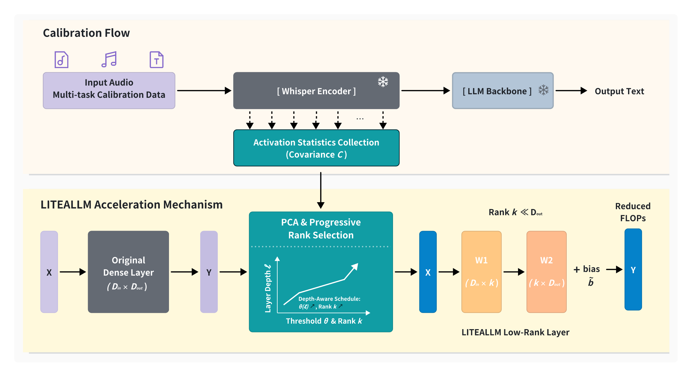

# LITEALLM

We propose LITEALLM, a method that compresses the encoder in large audio language models by using activation values, thereby improving encoding and inference speed.

## Table of Contents

- [Introduction](#introduction)
- [Getting Started](#getting-started)

## Introduction

<p align="center">
    
<p>

*   We propose LITEALLM, a calibration-based low-rank compression framework for Audio LLM encoders that replaces dense linear layers with PCA-derived low-rank projections, significantly reducing encoder FLOPs.
*   We design a depth- and type-aware compression schedule that linearly increases the variance-retention threshold across layers and calibrates on multiple audio tasks.
*   Experiments on diverse audio understanding benchmarks show that LITEALLM speeds up encoding by roughly 20\%, with only around a 2\% relative drop in accuracy.

## Getting Started

### Step1: Get the Code

```bash
git clone https://anonymous.4open.science/r/LITEALLM-E09D
cd LITEALLM
git submodule update --init --recursive
pip install -r requirements.txt
```

### Step2: Download the Pretrains Models

```bash
cd pretrains
huggingface-cli download --resume-download zai-org/glm-4-voice-tokenizer --local-dir glm-4-voice-tokenizer
huggingface-cli download --resume-download moonshotai/Kimi-Audio-7B-Instruct --local-dir Kimi-Audio-7B-Instruct
cd ..
```

### Step3: Download the Datasets for Compress and Eval

#### prepare datasets for sec, ar, aqa, emotion
```bash
mkdir SAVEE
mkdir mmau
mkdir nonspeech7k
mkdir clothoaqa
```
You can download the parquet files from Hugging Face and place them in the corresponding folder.
For example, AbstractTTS/SAVEE, lmms-lab/mmau, CLAPv2/Nonspeech7k, gijs/clothoaqa

#### prepare datasets for asr
This section is derived from data processing by [Kimi Audio Finetune](https://github.com/MoonshotAI/Kimi-Audio/blob/master/finetune_codes/README.md).
```bash
python finetune_codes/demo_data/audio_understanding/prepare_librispeech_asrtask.py --output_dir "output/data/librispeech"
```

### Step4: Compress and Eval
You can specify the task and data_path in `compress_kima.sh` to change the evaluation task.

for sec task, you can specify the task and data_path to change the evaluation task.
```bash
python compress_kima.py \
  --model_path pretrains/Kimi-Audio-7B-Instruct \
  --task sec \
  --data_path nonspeech7k/test.parquet \
  --output_dir output/compress \
  --model_max_length 1024 \
  --rank_threshold "0.98:0.98" \
  --num_test_samples 100 \
  --low_rank True \
  --calib_task asr \
  --calib_data_path output/data/librispeech/librispeech.jsonl \
  --num_calib_samples 100
```

then, run the shell, you can get the result. It costs about `10~20` minutes
```bash
bash compress_kima.sh
```

We use the ASR task to Calibrate data. If needed, you can also change the `calib_task` and `calib_data_path` parameters to use other tasks.
